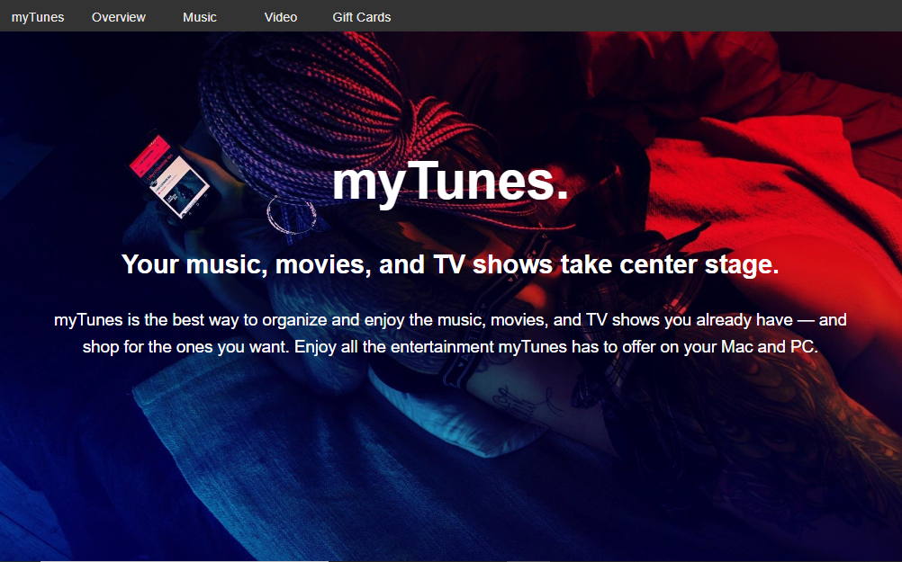

# MyTunes Landing Page
Criação de Website inspirado no itunes.

## Sobre o Projeto
Esse projeto tem finalidades acadêmicas e didáticas, trata-se da criação de uma landing page responsiva, seu modelo de criação tem como inspiração o site  iTunes, 

## Processo de Criação

- HTML5 Semântico
- CSS com variáveis
- JavaScript
- jQuery
- Flexbox
- CSS Grid
- Media Query
  

## Imagens do Projeto
---
 **Overview**

**Music Section**

**Video Section**

**Gift Card**

---

## Referências
 - [Traversy Media](https://www.youtube.com/watch?v=4sosXZsdy-s&t=194s)
